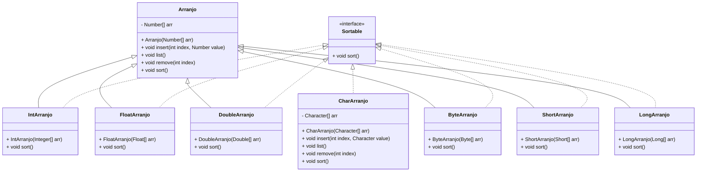

# Desafio: Classificação de Vários Arranjos Numéricos

## Descrição

Este projeto implementa uma estrutura para gerenciar e classificar diferentes tipos de arranjos numéricos em Java. Através do uso de herança, polimorfismo e interfaces, diversas classes são criadas para lidar com diferentes tipos numéricos (`int`, `float`, `double`, `byte`, `short`, `long`) e também com o tipo `char`.

## Estrutura do Projeto

### Classe Abstrata `Arranjo`

A classe `Arranjo` é uma classe abstrata genérica que define a estrutura básica para manipulação de arrays numéricos. Ela inclui métodos para inserir, listar e remover itens, além de um método abstrato `sort` que deve ser implementado pelas subclasses para ordenar os elementos.

### Interface `Sortable`

A interface `Sortable` define o método `sort`, que deve ser implementado por qualquer classe que precise de funcionalidade de ordenação.

### Subclasses de `Arranjo`

As subclasses de `Arranjo` implementam o método `sort` para diferentes tipos numéricos:
- `IntArranjo`
- `FloatArranjo`
- `DoubleArranjo`
- `ByteArranjo`
- `ShortArranjo`
- `LongArranjo`

### Classe `CharArranjo`

A classe `CharArranjo` é uma implementação separada para manipulação de arrays de caracteres, implementando diretamente a interface `Sortable`.

## Diagrama de Classes



## Uso

### Criação de um Arranjo e Inserção de Elementos

```java
Integer[] intArray = {5, 2, 9, 1, 5, 6};
IntArranjo intArranjo = new IntArranjo(intArray);
intArranjo.insert(0, 10);
intArranjo.list();
```

### Ordenação de Elementos

```java
intArranjo.sort();
intArranjo.list();
```

### Remoção de Elementos

```java
intArranjo.remove(0);
intArranjo.list();
```

### Manipulação de Diferentes Tipos

```java
Float[] floatArray = {5.5f, 2.2f, 9.9f};
FloatArranjo floatArranjo = new FloatArranjo(floatArray);
floatArranjo.sort();
floatArranjo.list();
```

### Manipulação de Caracteres

```java
Character[] charArray = {'e', 'b', 'a'};
CharArranjo charArranjo = new CharArranjo(charArray);
charArranjo.sort();
charArranjo.list();
```

## Contribuição

Contribuições são bem-vindas! Sinta-se à vontade para abrir uma _issue_ ou enviar um _pull request_.

## Licença

Este projeto está licenciado sob a Licença MIT. Veja o arquivo [LICENSE](LICENSE) para mais detalhes.